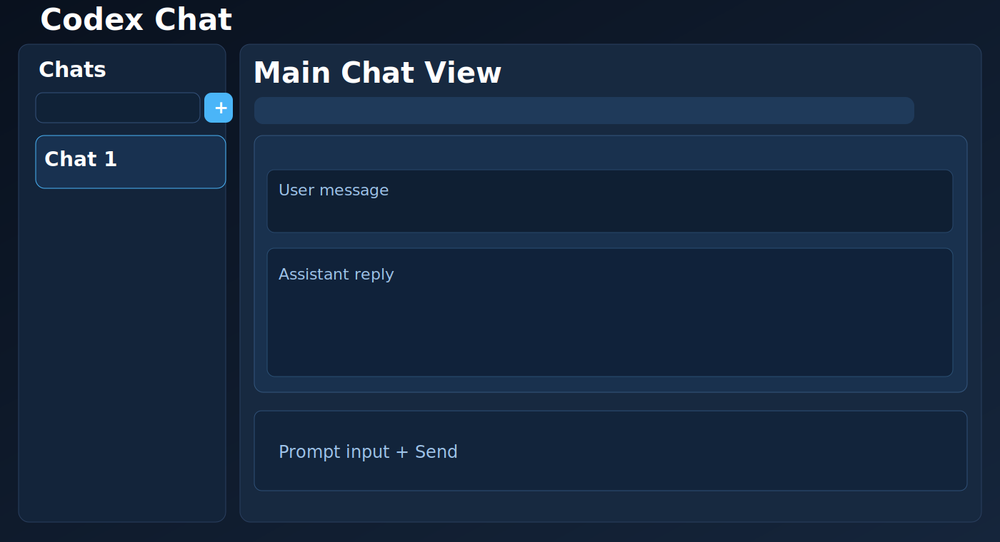
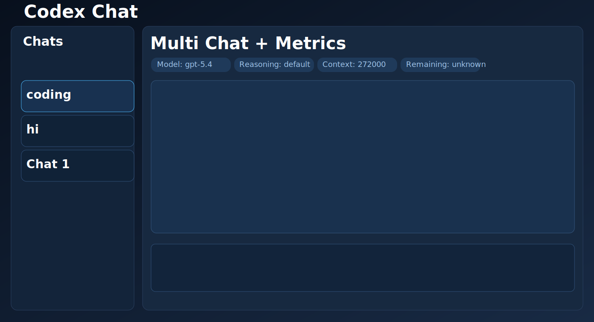
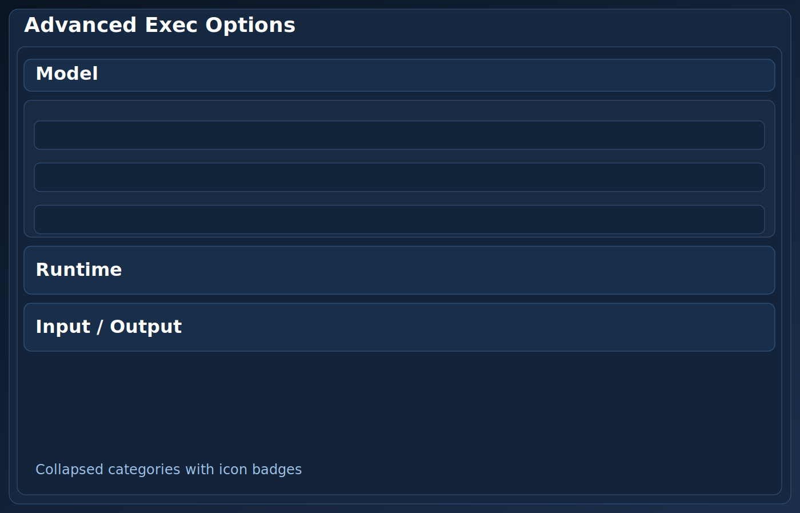
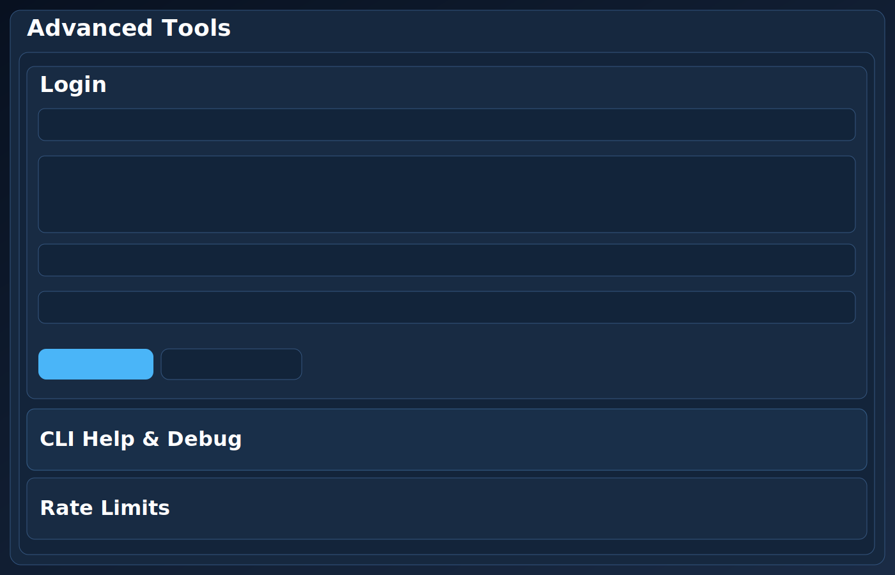

# Codex Django Chat UI

This project runs Codex CLI from a Django web app using local browser-based login credentials.
This is an unofficial project created by reverse-engineering the behavior and options of the Codex CLI and the Codex VS Code extension.

It uses a project-local auth store:
- `./.codex/auth.json`
- `CODEX_HOME=./.codex` for all Codex subprocess calls

No `sk-` key is required for ChatGPT login mode.

## Features

- Django-based web UI (replaces previous Flask app)
- Multi-chat sessions with independent Codex context threads (`codex exec resume <thread_id>`)
- Minimal chat-first layout (messages + composer), with advanced options collapsed
- Master dark theme enabled by default with one-click enable/disable toggle
- Browser login via `codex login`
- Login status check via `codex login status`
- Prompt execution via `codex exec`
- Local auth state viewer (`auth_mode`, account id, token preview, resolved Codex CLI path)
- Model chooser from local Codex model metadata (with custom model override)
- Reasoning controls (`model_reasoning_effort`, `model_reasoning_summary`, `model_verbosity`)
- Execution insights panel with:
  - token usage (from JSON events when available)
  - selected model context window and estimated remaining context
  - rate-limit fields when exposed by Codex CLI output
- Advanced option controls for Codex:
  - `exec`: `-c`, `--enable`, `--disable`, `--image`, `-m`, `--oss`, `--local-provider`, `--sandbox`, `--profile`, `--full-auto`, `--dangerously-bypass-approvals-and-sandbox`, `--cd`, `--skip-git-repo-check`, `--add-dir`, `--output-schema`, `--color`, `--json`, `-o`
  - `login`: `-c`, `--enable`, `--disable`, `--device-auth`, `--with-api-key`
- "Extra args" inputs for login/exec to pass any additional/new Codex options.
- CLI help viewer (`codex --help`, `codex exec --help`, `codex login --help`)

## Screenshots

These screenshots are embedded directly (inline) in the README:

## Requirements

- Windows (this repo currently targets your local setup)
- Codex CLI installed and working in terminal
- Python virtual environment: `env1`

## Run (always using `env1`)

1. Activate env:
   - PowerShell: `.\env1\Scripts\Activate.ps1`
2. Install deps:
   - `python -m pip install -r requirements.txt`
3. Migrate DB:
   - `python manage.py migrate`
4. Start server:
   - `python manage.py runserver`
   - if port 8000 is blocked on your machine: `python manage.py runserver 127.0.0.1:8010`
5. Open:
   - `http://127.0.0.1:8000` (or your custom port)

## Notes

- If Codex CLI is not found:
  - Set env var `CODEX_CLI_PATH` to your Codex executable path.
  - Typical global npm path on Windows:
    - `C:\Users\<you>\AppData\Roaming\npm\codex.cmd`
- Secrets are not committed:
  - `.codex/` is ignored in `.gitignore`.
- License:
  - This repo uses a custom non-production license. See `LICENSE`.
  - You can use, modify, and share it, but production use is not allowed.
